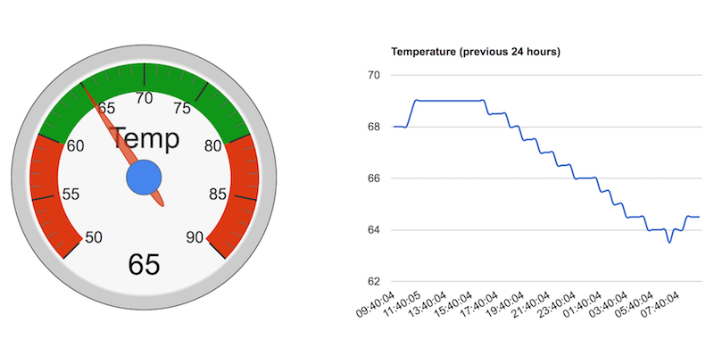

# Tempberry Pi 

This project documents a IoT temperature monitoring solution that is built on a
combination of technologies.

1. A Raspberry Pi to record temperatures and to trigger email alerts if
temperatures reach certain levels.
2. A PHP script that collects temperature readings
3. JavaScript that formats the colleted readings and makes them available via a
webpage.

## Temperature only

The output looks like

This project is based on the Adafruit tutorial at
<https://learn.adafruit.com/adafruits-raspberry-pi-lesson-11-ds18b20-temperature-sensing/hardware>.

## Hardware

The hardware is predominately based on the Raspberry Pi and the DS18B20
temperature sensor. The full breakdown of components that I used is:

* Raspberry Pi 2
* Pi Cobbler Breakout and Cable
* DS18B20 Digital Temperature Sensor
* 4k7 Ohm resistor
* Breadboard
* Jumper Wires

Follow the instructions in the tutorial linked to above to hook up all the
components. The good folks at Adafruit did an excellent job describing the
layout, so I am not going to reproduce it here.

## Client-side software

The client-side software conists of two Python scripts. The first,
`sens_temp.py`,  collects the temperature readings from the sensor, and the
second one, `trigger.py`, adds it to the log file and pushes it out to a web
server. The script is called via a cronjob that I have set to run every minute.

## Server-side software

The server-side software is nothing more than a PHP script. It used Google
Charts to generate the visuals. Full details about Charts can be found at
<https://developers.google.com/chart/>.

For the script to work properly, it needs to be able to write to two files:
`temp_now.txt`, which will contain the latest temperature reading, and
`temp_history.csv`, which will contain readings of up to the previous 24 hours.

# Temperature and humidity

The output looks like

This project is based on the Adafruit tutorial at
<https://pimylifeup.com/raspberry-pi-humidity-sensor-dht22/>.

## Hardware

The hardware is predominately based on the Raspberry Pi and the DS18B20
temperature sensor. The full breakdown of components that I used is:

* Raspberry Pi 2
* Pi Cobbler Breakout and Cable
* DHT22 Digital Temperature and Humidity Sensor
* 4k7 Ohm resistor
* Breadboard
* Jumper Wires

Follow the instructions in the tutorial linked to above to hook up all the
components. The good folks at Adafruit did an excellent job describing the
layout, so I am not going to reproduce it here.

## Client-side software

The client-side software consists of a Python script. The script is called
`sens_temp_humidity.py` and it collects the readings from the sensor and pushes them out to a web server. The script is called via a cronjob that I have set to run every five minutes.

## Server-side software

The server-side software is nothing more than a PHP script. It used Google
Charts to generate the visuals. Full details about Charts can be found at
<https://developers.google.com/chart/>.

For the script to work properly, it needs to be able to write to two files: `/var/temperature/temp_now.txt`, which will contain the latest readings, and `/var/temperature/temp_history.csv`, which will contain readings of up to the previous 24 hours.
